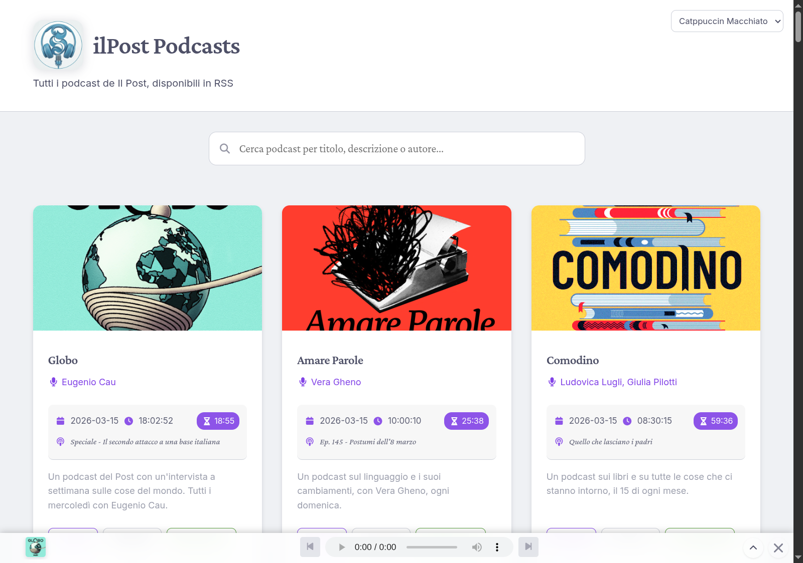
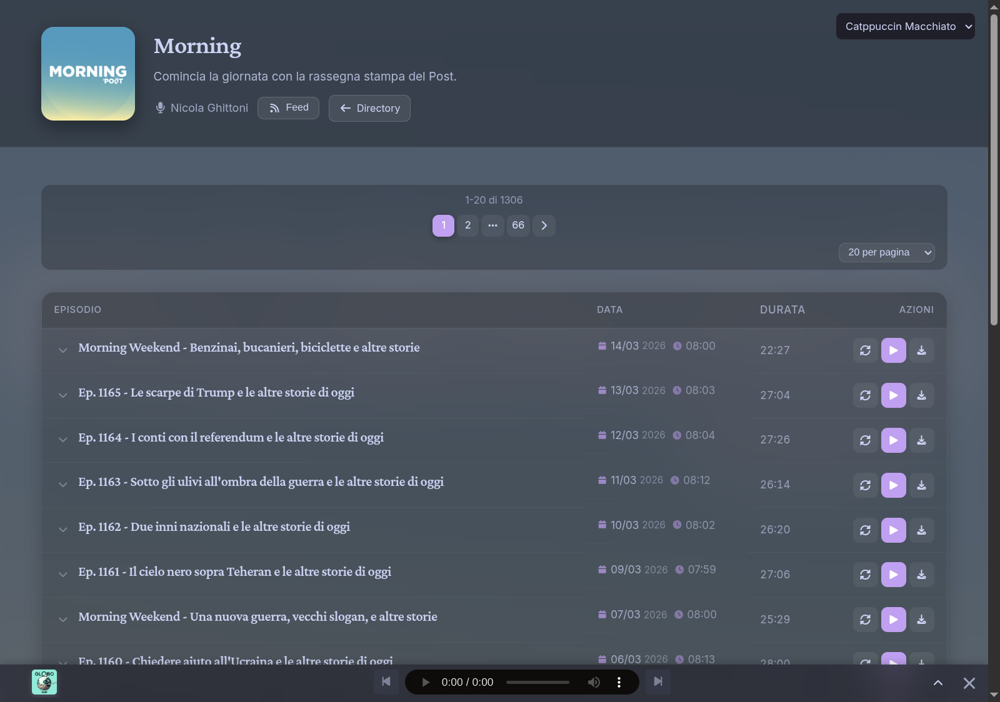
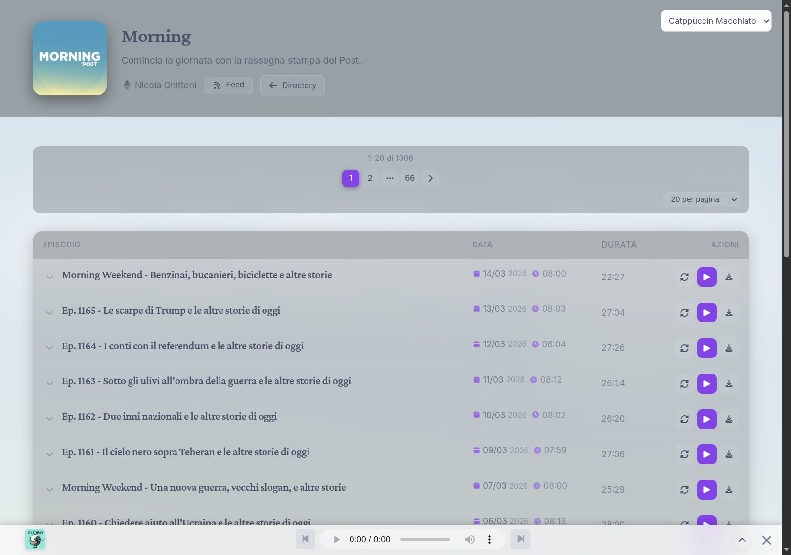
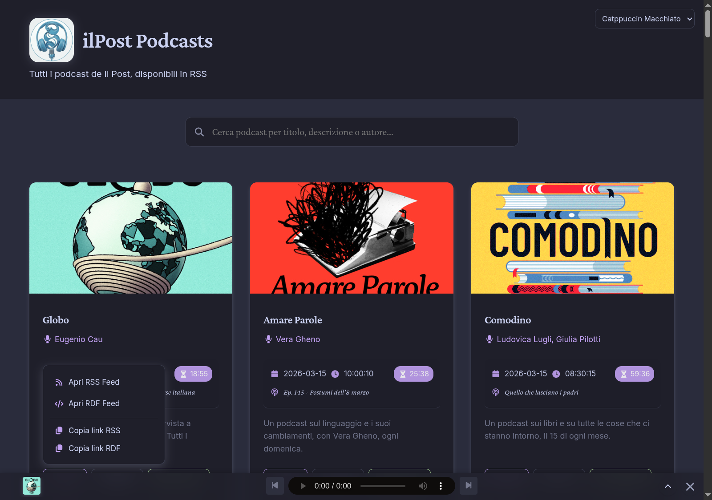

# ilPost Podcasts

[](https://github.com/thekoma/ilpostapi/actions)
[](https://github.com/thekoma/ilpostapi/releases)
[](https://github.com/thekoma/ilpostapi/commits)
[](https://github.com/thekoma/ilpostapi/pkgs/container/ilpostapi)
[](https://github.com/thekoma/ilpostapi/pkgs/container/ilpostapi)

Un'interfaccia web per accedere ai podcast de Il Post, con feed RSS/RDF e player audio integrato.

| Directory (Macchiato) | Directory (Latte) |
|---|---|
|  |  |

| Episodi (Macchiato) | Episodi (Latte) |
|---|---|
|  |  |

| Feed Popup |
|---|
|  |

## Funzionalità

### Interfaccia Web
- Design con temi [Catppuccin](https://github.com/catppuccin/catppuccin) (Latte, Frappe, Macchiato, Mocha)
- Player audio persistente con navigazione tra episodi (non si interrompe cambiando pagina)
- Ricerca fuzzy in tempo reale su titoli, descrizioni e autori
- Popup Feed con link RSS/RDF e copia negli appunti

### Episodi
- Cover del podcast nell'header con sfondo dinamico blurrato
- Paginazione con numero personalizzabile di elementi per pagina
- Descrizioni espandibili con formattazione HTML
- Riproduzione diretta e download dei file audio

### Feed RSS e RDF
- Feed RSS completo compatibile con tutti i principali aggregatori
- Feed RDF per integrazione con sistemi semantici
- Metadati completi: autore per episodio, immagine per episodio, summary, share URL
- Supporto iTunes/Apple Podcasts, Google Podcasts, Podcast Index

### Architettura
- **FastAPI** con moduli separati (routes, API client, feeds, auth)
- **SQLite** asincrono via SQLAlchemy per cache persistente
- **Navigazione pjax** — il player audio sopravvive ai cambi di pagina
- **Rate limiting** per le chiamate all'API de Il Post
- **Health checks** reali (`/healthz`, `/readyz`) per Kubernetes
- **MCP** (Model Context Protocol) endpoint integrato

## Requisiti

### Storage
- Volume persistente montato su `/data` per il database SQLite
- Dimensione consigliata: minimo 1GB
- Permessi di scrittura necessari per UID 1000

## Deploy

### Helm (bjw-s app-template)

Il chart usa [bjw-s app-template](https://bjw-s-labs.github.io/helm-charts/docs/app-template/).

1. Creare il secret con le credenziali:

```bash
kubectl create secret generic ilpost-api-credentials \
  --namespace ilpostapi \
  --from-literal=EMAIL='your-email@domain.com' \
  --from-literal=PASSWORD='your-password'
```

2. Installare:

```bash
helm repo add bjw-s https://bjw-s-labs.github.io/helm-charts
helm repo update

helm install ilpostapi bjw-s/app-template \
  --namespace ilpostapi \
  --create-namespace \
  -f deploy/helm/values.yaml
```

Per abilitare l'ingress o personalizzare, crea un file `my-values.yaml`:

```yaml
ingress:
  main:
    enabled: true
    className: nginx
    hosts:
      - host: ilpostapi.yourdomain.com
        paths:
          - path: /
            pathType: Prefix
            service:
              identifier: main
              port: http
    tls:
      - secretName: ilpostapi-tls
        hosts:
          - ilpostapi.yourdomain.com
```

```bash
helm install ilpostapi bjw-s/app-template \
  --namespace ilpostapi \
  --create-namespace \
  -f deploy/helm/values.yaml \
  -f my-values.yaml
```

### Docker Compose

```yaml
services:
  ilpostapi:
    image: ghcr.io/thekoma/ilpostapi:latest
    ports:
      - "5000:5000"
    environment:
      - TZ=Europe/Rome
      - EMAIL=your-email@domain.com
      - PASSWORD=your-password
    volumes:
      - ./data:/data
    restart: unless-stopped
```

```bash
mkdir -p ./data
docker compose up -d
```

L'applicazione sara' disponibile su `http://localhost:5000`.

## Sviluppo

```bash
# Copia e compila il secret
cp deploy/helm/secret.yaml.example deploy/helm/secret.yaml
# Edita deploy/helm/secret.yaml con le tue credenziali

# Avvia con skaffold (richiede minikube o cluster k8s)
skaffold dev --tail
```

Skaffold sincronizza automaticamente i file Python, HTML, CSS e JS nel pod senza rebuild.
