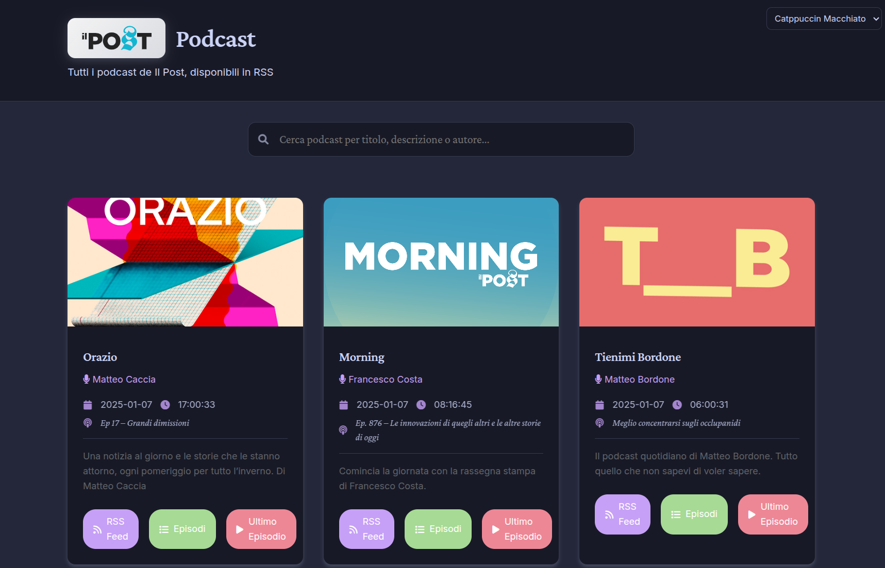

# Il Post Podcast API

[](https://github.com/thekoma/ilpostapi/actions)
[](https://github.com/thekoma/ilpostapi/releases)
[](https://github.com/thekoma/ilpostapi/commits)
[](https://github.com/thekoma/ilpostapi/pkgs/container/ilpostapi)
[](https://github.com/thekoma/ilpostapi/pkgs/container/ilpostapi)

Un'interfaccia web elegante per accedere ai podcast de Il Post.



## Funzionalità

### 🎧 Interfaccia Web
- Design moderno con temi Catppuccin (Latte, Frappé, Macchiato, Mocha)
- Player audio integrato con controlli di navigazione
- Visualizzazione dettagliata degli episodi con data, durata e descrizione
- Sfondo dinamico basato sulla copertina del podcast
- Ricerca fuzzy in tempo reale su titoli, descrizioni e autori

### 📅 Gestione Episodi
- Visualizzazione ordinata per data di pubblicazione
- Informazioni dettagliate sull'ultimo episodio (titolo, data e ora di rilascio)
- Paginazione degli episodi con numero personalizzabile di elementi per pagina
- Riproduzione diretta degli episodi con player integrato
- Download diretto dei file audio

### 🔄 Feed RSS
- Feed RSS compatibile con tutti i principali aggregatori
- Metadati completi per ogni episodio
- Supporto per iTunes/Apple Podcasts
- URL persistenti per ogni episodio

### ⚡ Performance
- Caching intelligente delle richieste API (15 minuti)
- Caricamento asincrono dei dati
- Interfaccia reattiva e fluida
- Ottimizzazione delle immagini e dei contenuti

### 🎨 Design
- Font serif per i titoli (Crimson Pro)
- Font sans-serif per il testo (Inter)
- Icone Font Awesome per una migliore UX
- Animazioni fluide e feedback visivo
- Tema adattivo chiaro/scuro

## Utilizzo

### 🚀 Deploy con Helm

Prima di deployare l'applicazione, è necessario creare un secret con le credenziali de Il Post. Puoi farlo in due modi:

1. Usando un file `secret.yaml`:
```yaml
# secret.yaml
apiVersion: v1
kind: Secret
metadata:
  name: ilpostapi
  labels:
    group: ilpostapi
stringData:
  EMAIL: your-email@domain.com
  PASSWORD: your-password
```

```bash
kubectl apply -f secret.yaml
```

2. O direttamente da linea di comando:
```bash
kubectl create secret generic ilpostapi \
  --from-literal=EMAIL=your-email@domain.com \
  --from-literal=PASSWORD=your-password \
  --labels=group=ilpostapi
```

Dopo aver creato il secret, puoi procedere con l'installazione dell'applicazione utilizzando Helm con il chart onechart:

```bash
helm repo add gimlet-io https://chart.gimlet.io
helm repo update

helm install ilpostapi gimlet-io/onechart \
  --version 0.73.0 \
  --set image.repository=ghcr.io/thekoma/ilpostapi \
  --set image.tag=latest \
  --set containerPort=5000 \
  --set resources.limits.cpu=50m \
  --set resources.limits.memory=100Mi \
  --set resources.requests.cpu=20m \
  --set resources.requests.memory=50Mi \
  --set container.imagePullPolicy=Always \
  --set secretName=ilpostapi
```

Per una configurazione più avanzata, puoi utilizzare un file `values.yaml`:

```yaml
resources:
  limits:
    cpu: "50m"
    memory: "100Mi"
  requests:
    cpu: "20m"
    memory: "50Mi"
containerPort: 5000
container:
  imagePullPolicy: Always
imagePullSecrets:
  - regcred
image:
  repository: ghcr.io/thekoma/ilpostapi
  tag: latest
secretName: ilpostapi
ingresses:
  - host: ilpostapi.yourdomain
    tlsEnabled: true
    tlsSecretName: ilpostapi-ingress-cloudflare-tls
```

### 🐳 Deploy con Docker Compose

Per un deploy locale o di sviluppo, puoi utilizzare Docker Compose. Crea un file `docker-compose.yaml`:

```yaml
version: '3.8'
services:
  ilpostapi:
    image: ghcr.io/thekoma/ilpostapi:latest
    ports:
      - "5000:5000"
    environment:
      - TZ=Europe/Rome
      - EMAIL=your-email@domain.com
      - PASSWORD=your-password
    restart: unless-stopped
    deploy:
      resources:
        limits:
          cpus: '500m'
          memory: 500M
        reservations:
          cpus: '100m'
          memory: 50M
```

Per avviare l'applicazione:

```bash
docker-compose up -d
```

L'applicazione sarà disponibile all'indirizzo `http://localhost:5000`

